# BorderIQ Architecture

| Field | Value |
|---|---|
| Title | BorderIQ Architecture Views |
| Version | 1.0 |
| Status | Draft for review |
| Owner | Jahnavi Ralhan |
| Last updated | 2026-08-01 |
| Scope | Rendered architecture views for the current MVP and the target platform. Each diagram carries a short explanation and a status label. Component contracts live in the [LLD](LLD.md); requirements in the [PRD](PRD.md). |
| Related documents | [PRD](PRD.md), [LLD](LLD.md), [API_SPEC](API_SPEC.md), [DATA_MODEL](DATA_MODEL.md), [DECISION_ENGINE](DECISION_ENGINE.md), [TOOL_CALLING](TOOL_CALLING.md), [KNOWLEDGE_GRAPH](KNOWLEDGE_GRAPH.md), [SECURITY](SECURITY.md), [DEPLOYMENT](DEPLOYMENT.md), [ROADMAP](ROADMAP.md), [AGENTS](AGENTS.md) |

Labelling follows the convention defined in the [PRD](PRD.md). Diagrams 1 and 2 show what exists today (with the backend portions marked as described, pending verification under OQ-01). Diagrams 3 onward are Target architecture (Proposed) unless stated otherwise. Component identifiers (C-01 to C-23) match the LLD Section 6 inventory.

## 1. Current MVP Context Diagram

The MVP is a single-user, single-tenant demonstration: a browser client, a Flask backend over a local vector store, and one external AI provider. There is no durable enterprise data.

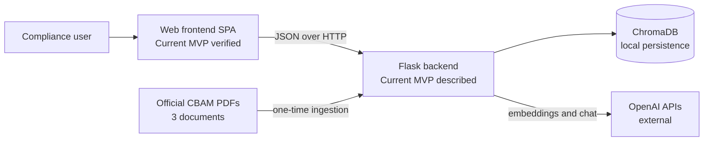

## 2. Current MVP Container Diagram

The frontend carries a demo rules engine and demo datasets, all labelled in the UI; the backend carries retrieval and narration. Nothing writes durable state.

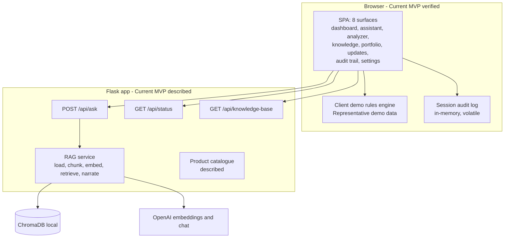

## 3. Target Enterprise Context Diagram

Target architecture (Proposed). BorderIQ sits between enterprise operational systems and the compliance obligation, consuming authoritative regulation on one side and enterprise records on the other, and emitting reviewed, replayable decisions.

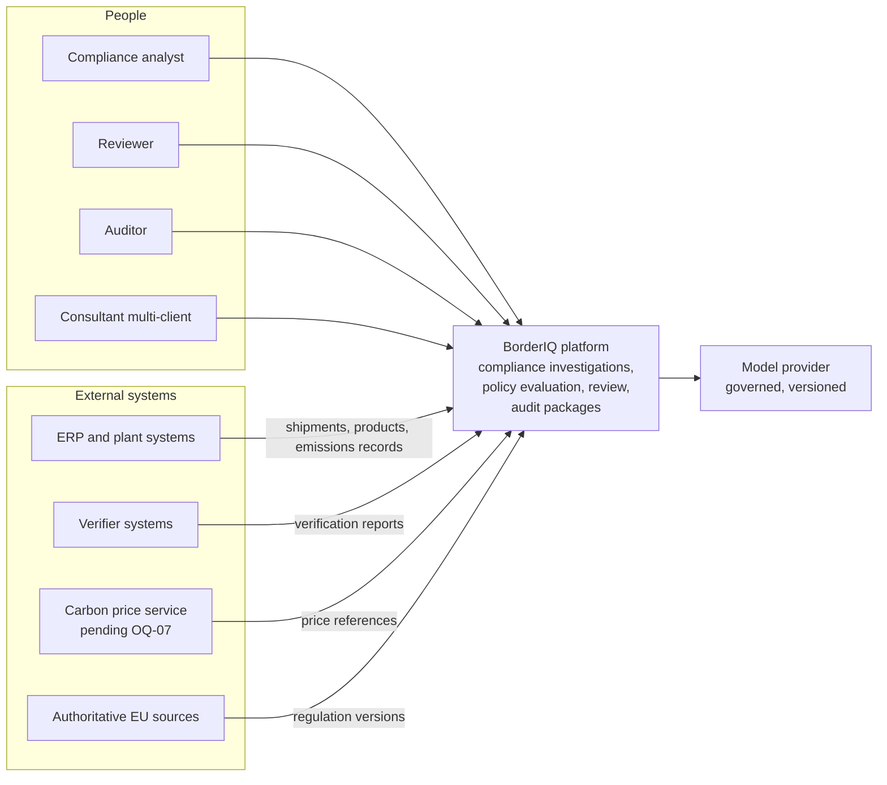

## 4. Target Container Diagram

Target architecture (Proposed). One modular monolith (LLD Section 5) with strict module seams, plus external stores. Arrows are in-process calls until the extraction thresholds in LLD Section 36.

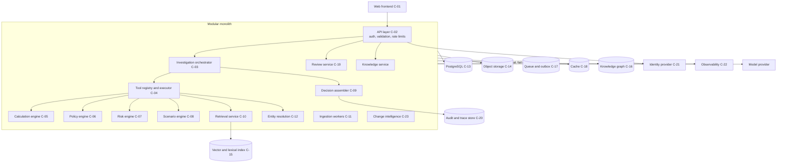

## 5. Shipment-Investigation Sequence

Target architecture (Proposed, Phase 2 onward). The orchestrator drives the 16-stage lifecycle from [DECISION_ENGINE.md](DECISION_ENGINE.md); this view compresses it to the principal interactions. Figures come only from the calculation engine; the model narrates after assembly.

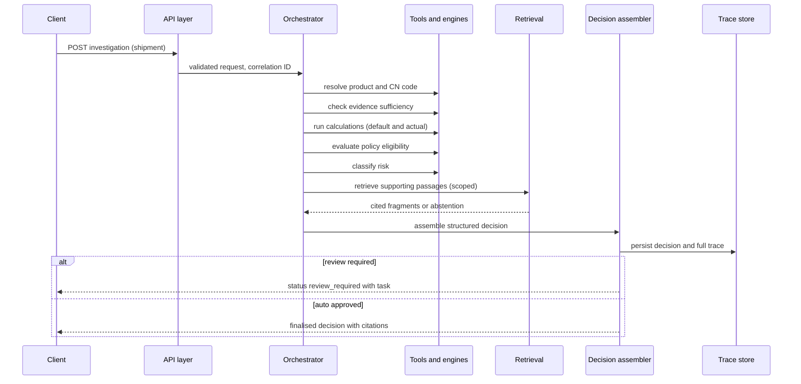

## 6. Regulatory-Question Sequence

Current MVP (described) implements the unscoped form of this flow; the scoped pipeline with sufficiency checks and abstention is Target architecture (Proposed, Phase 5).

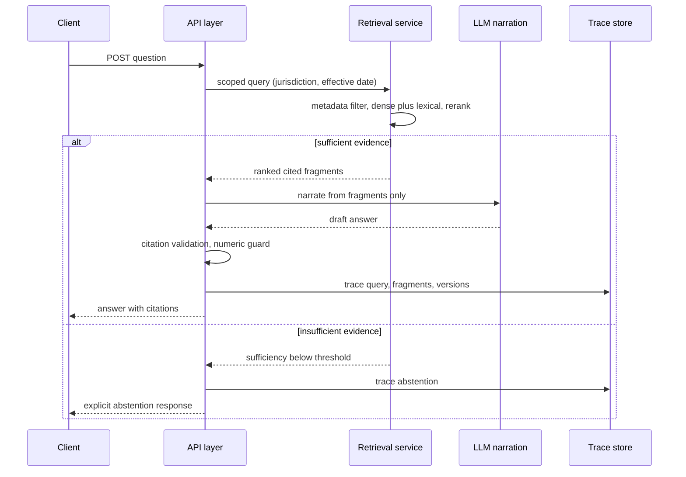

## 7. Tool-Calling Sequence

Target architecture (Proposed, Phase 2). The model selects tools from the registry; the executor owns validation, permissions, execution, and tracing. The model never receives unvalidated output and cannot fabricate a result ([TOOL_CALLING.md](TOOL_CALLING.md)).

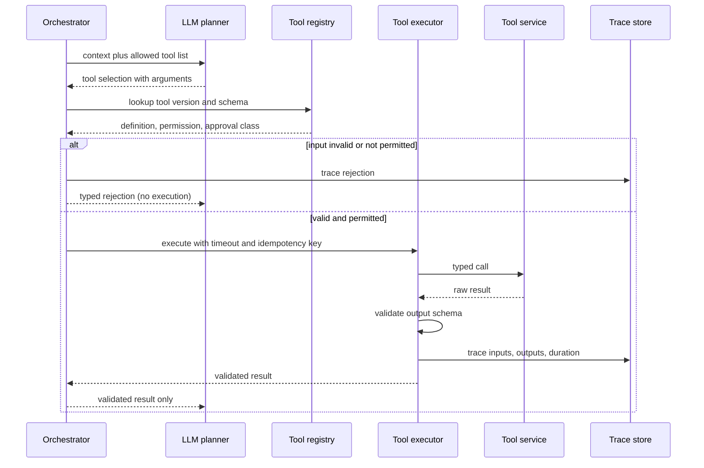

## 8. Regulatory Ingestion Pipeline

Target architecture (Proposed, Phase 5). Current MVP (described) implements the minimal load-chunk-embed path without registry, checksums, or structural parsing. Idempotent by checksum; changed files create versions, never overwrites.

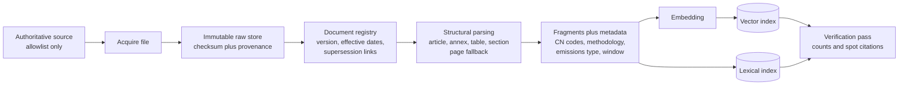

## 9. Regulatory-Change Workflow

Target architecture (Proposed, Phase 5). No policy changes without recorded human approval (AIR-010); the change itself becomes part of the audit record.

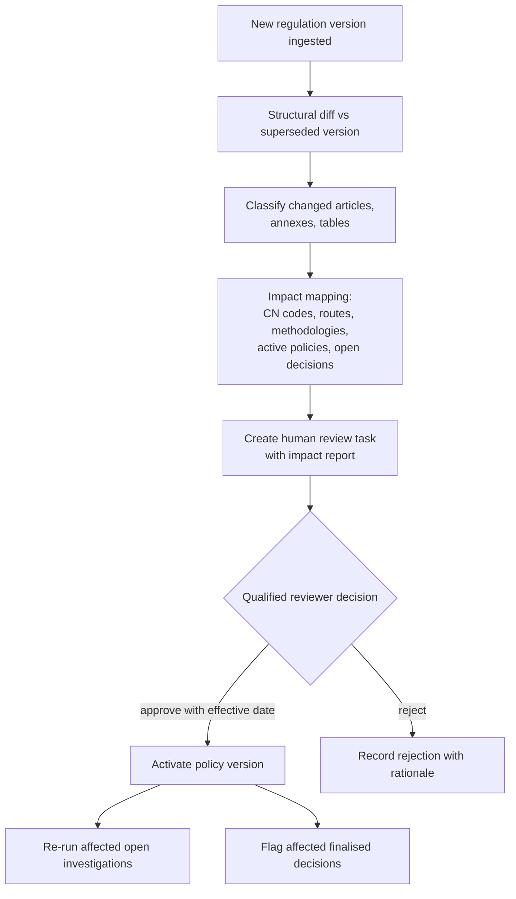

## 10. Human-Review Workflow

Target architecture (Proposed, Phase 4). Routing rules are listed in PRD Section 25; every reviewer action joins the decision trace.

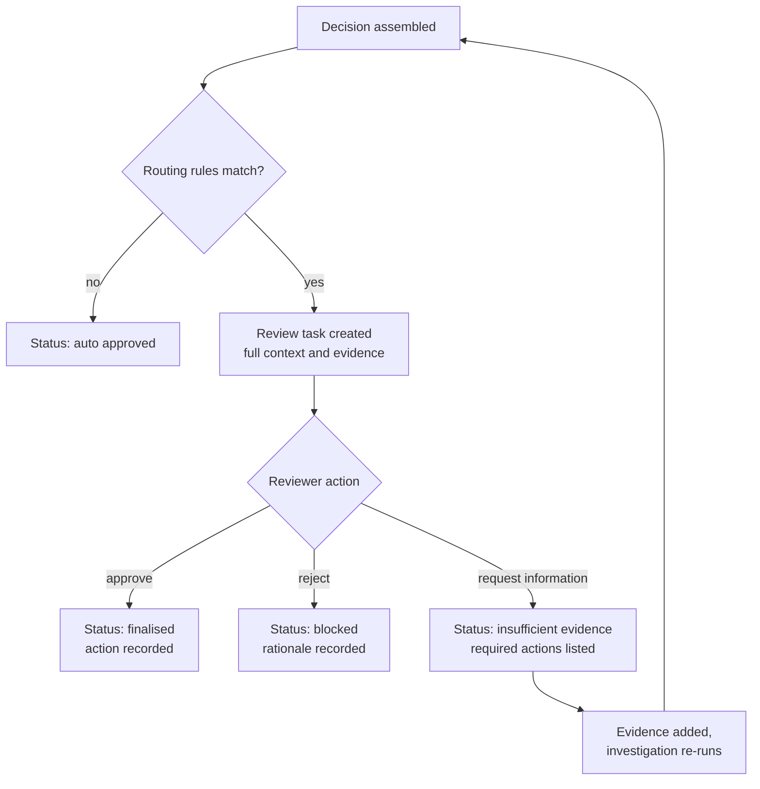

## 11. Decision-Replay Workflow

Target architecture (Proposed, Phase 2 trace, Phase 4 full package). Replay reads only the stored trace and pinned versions; it never touches live systems, and must reproduce figures byte-identically (NFR-001).

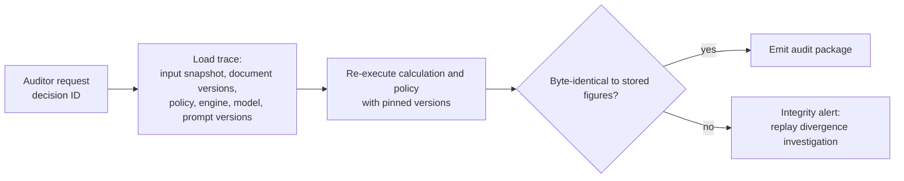

## 12. Batch-Ingestion Workflow

Target architecture (Proposed, Phase 3). Per-row outcomes, never all-or-nothing; ambiguous mappings route to review instead of guessing (FR-010, FR-011).

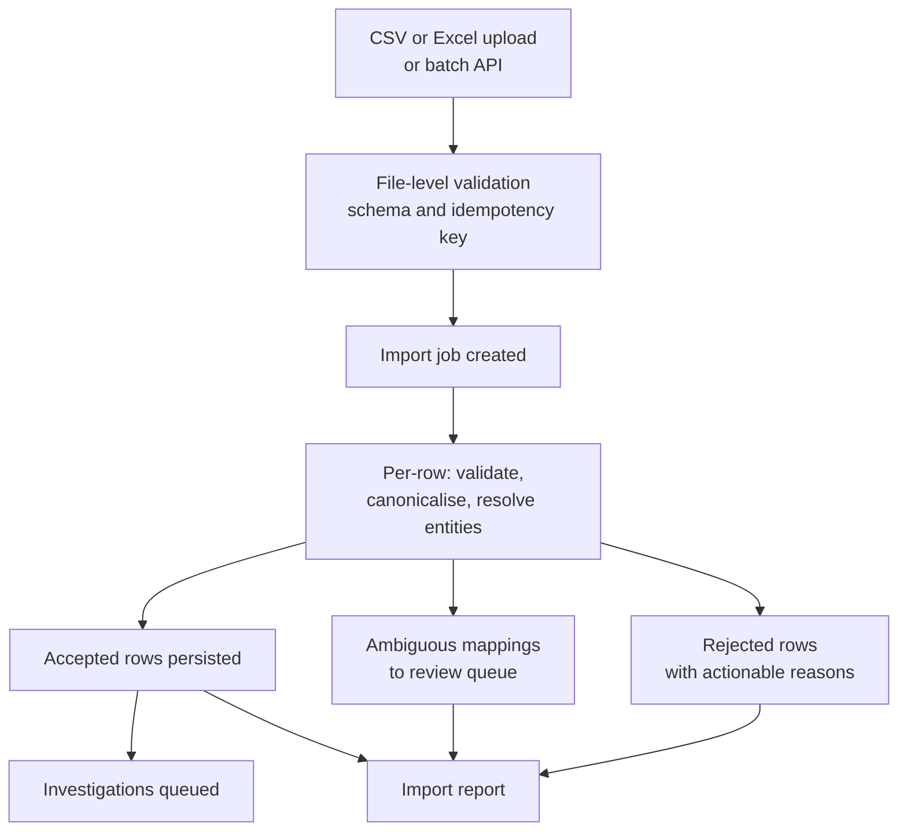

## 13. Event-Driven Workflow

Target architecture (Proposed, Phase 3): transactional outbox with a lightweight queue; idempotent consumers; dead-letter after bounded retries. Kafka-class platforms only past the thresholds in [DEPLOYMENT.md](DEPLOYMENT.md).

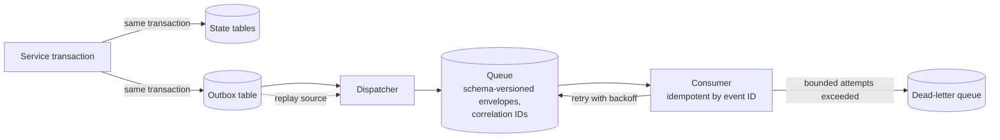

## 14. Multi-Tenant Isolation View

Target architecture (Proposed, Phase 9). Tenancy is enforced at every layer by construction; the repository layer refuses tenant-less access, and NFR-007 tests verify zero cross-tenant results.

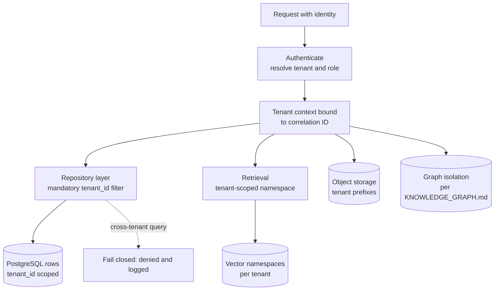

## 15. Deployment View

Target architecture (Proposed); the authoritative environment matrix and thresholds live in [DEPLOYMENT.md](DEPLOYMENT.md). One application image serves API and workers; managed stores; no Kubernetes before its documented threshold.

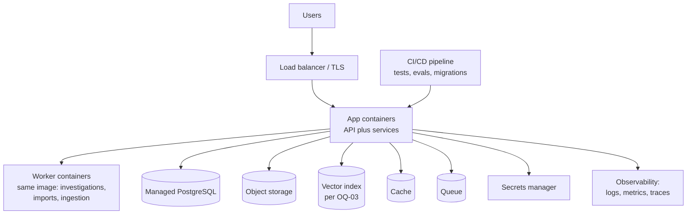

## 16. Trust Boundaries

Target architecture (Proposed); detailed threat model in [SECURITY.md](SECURITY.md). Retrieved regulation text and uploaded documents are data inside the application zone, never instructions (AIR-006).

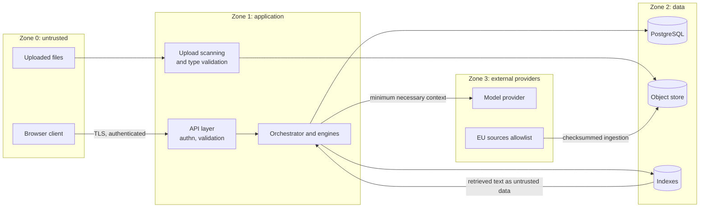

## 17. Data-Lineage Diagram

Target architecture (Proposed, Phases 2 to 5). Every figure and claim in a decision traces back to versioned sources; the audit package is the closure of this graph for one decision (FR-020).

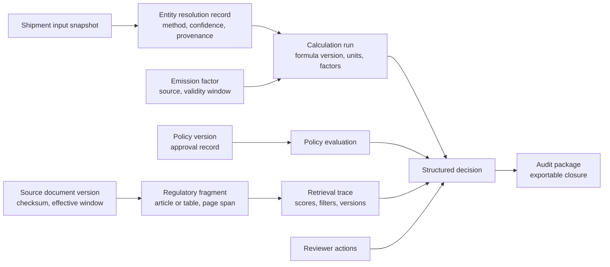
