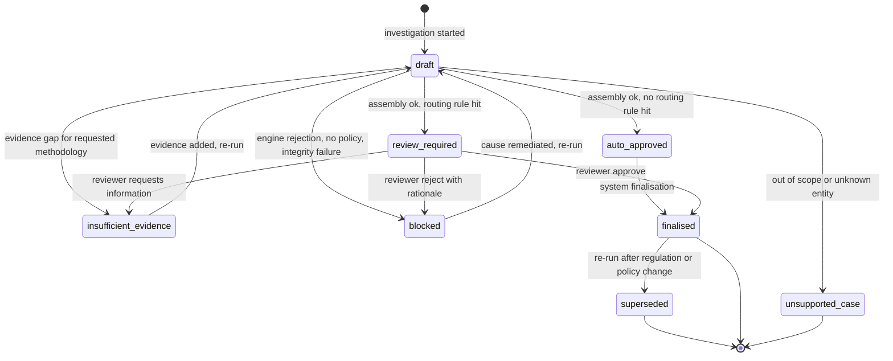

# BorderIQ Decision Engine

| Field | Value |
|---|---|
| Title | BorderIQ Decision Engine |
| Version | 1.1 |
| Status | Draft for review |
| Owner | Jahnavi Ralhan |
| Last updated | 2026-08-01 |
| Scope | The semantics of a compliance investigation: the 16-stage lifecycle, the structured decision object, the status state machine, confidence dimensions, conflict resolution, abstention, replay, and scenario comparison. Persistence shapes live in [DATA_MODEL](DATA_MODEL.md); orchestration mechanics in [LLD](LLD.md) Section 10; tool contracts in [TOOL_CALLING](TOOL_CALLING.md). |
| Related documents | [PRD](PRD.md), [LLD](LLD.md), [ARCHITECTURE](ARCHITECTURE.md), [DATA_MODEL](DATA_MODEL.md), [TOOL_CALLING](TOOL_CALLING.md), [API_SPEC](API_SPEC.md), [KNOWLEDGE_GRAPH](KNOWLEDGE_GRAPH.md), [SECURITY](SECURITY.md), [ROADMAP](ROADMAP.md), [AGENTS](AGENTS.md) |

Status of everything in this document: Target architecture (Proposed, Phases 2 to 7 per [ROADMAP.md](ROADMAP.md)). The current MVP implements a reduced ancestor: single-shipment server-side analysis (verified: catalogue resolution, deterministic calculation, supporting-regulation retrieval) with a session-only trace, as documented in the [PRD](PRD.md) Section 17. Requirement anchors: FR-012 to FR-020, AIR-001 to AIR-008.

## 1. Document Control

| Version | Date | Author | Change |
|---|---|---|---|
| 1.0 | 2026-08-01 | Jahnavi Ralhan | Initial decision-engine specification against PRD v3.0, LLD v1.0, DATA_MODEL v1.0 |
| 1.1 | 2026-08-01 | Jahnavi Ralhan | Current-MVP framing updated to verified server-side analysis |

## 2. Purpose and Position

This is the document that defines what BorderIQ produces. A general-purpose model produces prose about regulations; BorderIQ produces a structured compliance decision: a machine-validated object stating whether a shipment can be reported under a proposed methodology, on what evidence, at what estimated financial impact, and with what required next steps, with every figure and claim traceable to versioned sources.

Three invariants govern everything below:

1. **Figures only from engines.** Every numeric in a decision references a CalculationRun (AIR-001, FR-015).
2. **Eligibility only from policies.** Methodology eligibility is the output of the policy engine evaluating activated PolicyVersions, never model judgement (FR-014).
3. **No partial decisions.** An investigation ends in exactly one well-defined status; assembly failure fails closed (LLD Section 16).

## 3. Lifecycle Overview

Sixteen stages, executed by the Investigation Orchestrator (LLD Section 10.1) in a deterministic default order. Stages 1 to 4 are preconditions; 5 to 10 are the analytical core; 11 to 13 produce the decision; 14 to 16 govern and preserve it.

| # | Stage | Owner component | Can short-circuit to |
|---|---|---|---|
| 1 | Intake | Import service | rejected request (never a decision) |
| 2 | Validation | Import service | rejected request |
| 3 | Canonicalisation | Import service | stage 4 |
| 4 | Entity resolution | C-12 | unsupported_case, review_required |
| 5 | Applicability resolution | C-06 context | unsupported_case |
| 6 | Policy-version selection | C-06 | blocked |
| 7 | Evidence sufficiency | C-06 rules over evidence states | insufficient_evidence |
| 8 | Calculation | C-05 | blocked (engine rejection) |
| 9 | Policy evaluation | C-06 | per decision table |
| 10 | Risk classification | C-07 | none (always completes) |
| 11 | Regulatory grounding | C-10 | grounding_pending flag |
| 12 | Consistency validation | C-09 | blocked |
| 13 | Decision assembly | C-09 | blocked (schema failure) |
| 14 | Review routing | C-19 | review_required |
| 15 | Finalisation | C-19 or system | finalised |
| 16 | Audit packaging | C-20 | export on demand |

## 4. Stage Specifications

Each stage: purpose, inputs, outputs, failure handling. Tool names in parentheses reference [TOOL_CALLING.md](TOOL_CALLING.md).

**Stage 1, Intake.** Accept the investigation request (form, import row, batch API item, later event). Output: an immutable input snapshot written to object storage before any processing (Shipment.input_snapshot_ref). Failure: malformed request rejected at the API with field errors; no investigation record is created.

**Stage 2, Validation.** Structural and semantic checks: required fields, unit parseability, value ranges, reporting-period format. Output: a validated typed request. Failure: rejection with per-field reasons; import rows carry the reasons into the import report (FR-010).

**Stage 3, Canonicalisation.** Normalise text (casing, whitespace, unit spellings), attach tenant context, assign the investigation ID and correlation ID. Never lossy: raw values remain in the snapshot.

**Stage 4, Entity resolution** (resolve_product, resolve_cn_code, fetch_supplier, fetch_installation, classify_production_route). Resolve raw identifiers to canonical entities per LLD Section 20. Outputs: resolved references with method, confidence, provenance. Failures: unknown entity produces status unsupported_case; ambiguous mapping produces a review-queue item and, if the investigation cannot proceed without it, status review_required with reason ambiguous_mapping.

**Stage 5, Applicability resolution.** Determine whether the shipment is in scope at all: CBAM-covered CN code, covered destination, covered period. Output: applicability verdict with the reference data consulted. Failure: out-of-scope produces unsupported_case with the stated reason (this is a valid, useful answer, not an error).

**Stage 6, Policy-version selection** (resolve_policy_version). Bind the investigation to the regulation and policy versions effective for the reporting period (FR-012, DATA_MODEL Section 11). Output: pinned version set recorded in provenance. Failure: no active policy version for the period produces blocked with reason no_effective_policy; overlapping versions is an integrity error (write-time invariant violated) and alerts.

**Stage 7, Evidence sufficiency** (validate_supplier_declaration, validate_verifier_report, validate_evidence_completeness). Evaluate required evidence classes for each candidate methodology against evidence data-quality states (FR-013). Output: per-methodology evidence verdicts and a missing_evidence list. Failure semantics: insufficient evidence for the requested methodology is not an error; it flows into the decision table (Section 8) and can yield insufficient_evidence or a defaults-based decision, depending on what the user asked.

**Stage 8, Calculation** (retrieve_default_emission_value, retrieve_emission_factor, retrieve_carbon_price, calculate_direct_emissions, calculate_indirect_emissions, calculate_precursor_emissions, calculate_embedded_emissions, calculate_default_scenario, calculate_actual_scenario, estimate_cbam_exposure, compare_reporting_scenarios). Execute deterministic calculations for every methodology whose inputs exist, producing CalculationRuns with full lineage. Failure: engine rejections (unit, validity, missing input) are terminal for the affected run; if no run succeeds, status blocked with the engine reasons.

**Stage 9, Policy evaluation** (evaluate_reporting_eligibility). Evaluate activated policies over the context: methodology eligibility, thresholds. Output: eligibility per methodology with policy citations (PolicyVersion IDs). Conflicting policy outcomes: Section 9.

**Stage 10, Risk classification** (calculate_risk_score, detect_data_anomaly). Deterministic scoring per LLD Section 14. Output: risk class plus contributing factors. This stage always completes; missing inputs degrade to the most conservative class with a stated reason.

**Stage 11, Regulatory grounding** (retrieve_regulatory_evidence). Scoped retrieval of the passages supporting the eligibility outcome and methodology (FR-023). Output: supporting_sources with fragment IDs, versions, pages, scores. Failure: retrieval abstention does not invalidate the deterministic outcome; the decision carries retrieval_sufficiency low and a grounding_pending required action, and routing (Section 8) sends material cases to review.

**Stage 12, Consistency validation.** Cross-checks before assembly: figures reference existing successful CalculationRuns; every eligibility claim cites a policy; every regulatory claim maps to a retrieved fragment; units and periods coherent across the object. Failure: blocked with integrity reasons and an alert (this indicates a defect, not a business outcome).

**Stage 13, Decision assembly.** Build and schema-validate the decision object (LLD Section 16), compute the confidence dimensions (Section 6), then generate the narrative from the object with citation and numeric guards (LLD Section 29). Failure: schema invalidity fails closed to blocked; narrative failure leaves the decision valid with narrative pending (LLD Section 38).

**Stage 14, Review routing.** Apply routing rules (PRD Section 25) to the assembled decision. Output: status auto_approved, or review_required plus a ReviewTask with reason and context.

**Stage 15, Finalisation.** auto_approved decisions finalise automatically; review_required decisions finalise, block, or return for evidence per reviewer action (create_review_task consumers; ARCHITECTURE Section 10). Every transition is recorded with actor.

**Stage 16, Audit packaging** (generate_decision_package, generate_audit_package). The trace is complete by construction; packaging materialises the manifest closure on demand or on export (DATA_MODEL AuditPackage; FR-020).

## 5. Structured Decision Object

Persistence shape: DATA_MODEL Section 4.8 (ComplianceDecision). Semantic rules per field group:

- **status**: exactly one of the state-machine states (Section 7); nothing outside it exists.
- **methodology and eligibility**: methodology is the concluded reporting basis (actuals, defaults, mixed); eligibility records the verdict for every evaluated methodology with its policy citations, including the ones not chosen, so the road not taken is auditable.
- **figures**: references into CalculationRuns only; the renderer resolves them for display. A decision literally cannot contain a free-standing number in a figure field.
- **assumptions**: declared inputs that were choices rather than facts (price source, reference-date rule applied), each with origin.
- **missing_evidence and required_actions**: the actionable gap list; empty on clean decisions.
- **risk**: class plus contributing factors; never a bare label.
- **supporting_sources**: fragment references with versions and pages; the citation set the narrative is allowed to use.
- **applied_policies**: every PolicyVersion consulted, hit or miss.
- **reviewer_state**: task reference and action history; the only mutable region post-assembly, and every mutation is audited.
- **confidence**: Section 6; five dimensions, no aggregate.
- **narrative**: generated from the object after validation; regenerating it never changes the object.
- **provenance**: the pinned version set (model, prompt, engines, corpus, policy set, decision schema) that makes replay possible.

## 6. Confidence Dimensions

No single confidence percentage exists anywhere (AIR-005). Five dimensions, each reported as a level (high, medium, low) plus a stated basis:

| Dimension | high | medium | low |
|---|---|---|---|
| mapping | Deterministic or human-approved alias | Fuzzy match at or above the approval threshold, unreviewed | Fuzzy below threshold, or conflicting aliases |
| evidence_completeness | All required classes validated and in window | Required classes present, some unverified | Missing or expired required evidence |
| retrieval_sufficiency | Sufficiency check passed with reranked support | Passed without reranker, or thin margin | Abstained or below threshold |
| policy_certainty | Single applicable active version, clean evaluation | Version applicable with documented interpretation choice | Conflicting policies or no effective version |
| calculation_validity | All runs ok on golden-tested formula versions | Runs ok with declared assumption inputs | Any rejected run in the chosen path |

Levels are computed by deterministic rules from trace facts (the basis string cites those facts); they are not model self-assessments. Any dimension at low forces review routing for material cases (Section 8).

## 7. Status Model and State Machine

States: draft, auto_approved, review_required, blocked, insufficient_evidence, unsupported_case, finalised, superseded.

Rules: re-runs create a new investigation bound to the same shipment line; the prior decision moves to superseded with a link, never edited (PP-8). unsupported_case is terminal by design: it is a correct answer ("this is not a CBAM case"), re-entered only by a changed shipment.

## 8. Decision Table

Status determination at assembly, applied top-down, first match wins:

| # | Condition | Status | Notes |
|---|---|---|---|
| 1 | Out of scope, or unresolved entity with no path forward | unsupported_case | Stage 4 or 5 |
| 2 | No effective policy version for the period | blocked | reason no_effective_policy |
| 3 | Engine rejection on every candidate methodology | blocked | engine reasons attached |
| 4 | Consistency validation failure | blocked | integrity alert |
| 5 | Requested methodology fails evidence sufficiency and no permitted fallback requested | insufficient_evidence | missing_evidence populated |
| 6 | Any confidence dimension low AND exposure above tenant materiality threshold (OQ-12) | review_required | reason names the dimension |
| 7 | Routing rule hit (PRD Section 25 list: ambiguity, conflicts, expired evidence, materiality, novel route, policy interpretation) | review_required | reason from the rule |
| 8 | Retrieval abstained (grounding_pending) AND exposure immaterial | auto_approved with required action grounding_pending | deterministic outcome stands; citation completed asynchronously |
| 9 | Otherwise | auto_approved | clean path |

## 9. Failure States and Conflict Resolution

**Failure states** are statuses, not exceptions (LLD Section 27): blocked (system or governance impediment; carries machine-readable reasons), insufficient_evidence (evidential impediment; carries the gap list), unsupported_case (scope verdict). Exceptions are reserved for defects and dependency failures and never surface as decisions.

**Conflict resolution**, deterministic and recorded:

- Conflicting policy outcomes for the same methodology and period: never auto-tiebreak; policy_certainty low, review_required with reason policy_conflict, and a policy-maintenance task is raised (this is a governance bug to fix at the source).
- Conflicting evidence (two validated records disagreeing for the same window): evidence state conflicting, insufficient_evidence or review per materiality; the decision lists both records.
- Conflicting entity aliases: resolution refuses (LLD Section 20); review queue.
- Regulation-version boundary cases (period straddles an effective date): the reference-date rule (OQ-15) decides; the applied rule is recorded as an assumption.

## 10. Abstention

Abstention is a first-class outcome at two layers. Retrieval abstention (AIR-004): sufficiency below threshold returns no passages rather than the best bad passage; effects per decision-table rows 6 to 8. Q&A abstention: the Compliance Assistant returns an explicit insufficient-evidence response with what was searched and why it fell short, never a hedged guess. Abstention events are traced and counted (abstention accuracy is an evaluation metric, PRD Section 29); an abstention is a correct behaviour, and the evaluation suite penalises wrong-confidence answers more than honest abstentions.

## 11. Replay

Replay (NFR-001, FR-020) reconstructs a decision from its trace with pinned versions: load the input snapshot, resolved entities, factor and evidence references, policy and formula versions, corpus version; re-execute calculation and policy engines; diff against stored results byte-for-byte. Divergence raises an integrity alert (ARCHITECTURE Section 11): it means an engine version was not truly pure, a pinned version is missing, or stored data was tampered with; all three are incidents. Replay never calls the model and never touches live reference data; the narrative is not re-generated (it is stored).

## 12. Versioning

The decision object carries decision_schema in provenance (OQ-13); replays validate against the schema the decision was born under. Supersession (Section 7) versions the decision itself: a superseding decision links its predecessor and records the trigger (regulation change, policy change, evidence change). Scenario objects are never versions of the decision; they are annotations beside it (Section 13).

## 13. Scenario Comparison

Scenarios (FR-016, FR-026; DATA_MODEL Scenario) run against a decision twin version: an immutable snapshot of the decision's inputs. A scenario declares an assumption delta, re-runs stages 8 to 10 with the delta, and yields a comparison: base figures versus scenario figures, eligibility changes, risk changes. Invariants: scenarios never mutate or supersede the official decision; every surface labels scenario output as hypothetical; scenario assumptions are part of the scenario record; comparing default versus actual reporting for an eligible shipment is itself a standard scenario (compare_reporting_scenarios) and its output feeds the savings framing shown in the product.

## 14. Open Questions

Owned in the [PRD](PRD.md) Section 36: OQ-12 (materiality threshold defaults, decision-table row 6), OQ-13 (decision schema versioning), OQ-15 (reference-date rule, Section 9). New: OQ-16: whether decision-table row 8 (auto-approve with grounding pending) should be tenant-configurable off, forcing synchronous grounding for conservative tenants. Recommendation: yes, configurable, default off for the first pilots.
