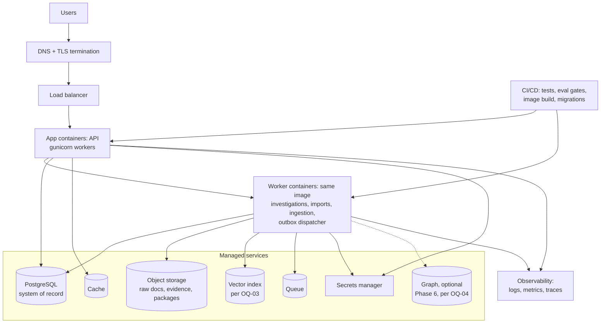

# BorderIQ Deployment

| Field | Value |
|---|---|
| Title | BorderIQ Deployment |
| Version | 1.0 |
| Status | Draft for review |
| Owner | Jahnavi Ralhan |
| Last updated | 2026-08-01 |
| Scope | How BorderIQ runs: the verified current local deployment, the target cloud-neutral topology, environments, CI/CD, migrations, backups, disaster recovery, scaling stages, and the adoption thresholds for heavier infrastructure. Component design lives in [LLD](LLD.md); security controls in [SECURITY](SECURITY.md). |
| Related documents | [PRD](PRD.md), [LLD](LLD.md), [ARCHITECTURE](ARCHITECTURE.md), [DATA_MODEL](DATA_MODEL.md), [API_SPEC](API_SPEC.md), [SECURITY](SECURITY.md), [KNOWLEDGE_GRAPH](KNOWLEDGE_GRAPH.md), [ROADMAP](ROADMAP.md) |

Labelling per the [PRD](PRD.md) convention. Section 3 is Current MVP (verified against the code and fix set of 2026-08-01). Everything from Section 4 onward is Target architecture (Proposed), phased per [ROADMAP.md](ROADMAP.md).

## 1. Document Control

| Version | Date | Author | Change |
|---|---|---|---|
| 1.0 | 2026-08-01 | Jahnavi Ralhan | Initial deployment design; current-deployment section verified against code |

## 2. Scope

In scope: runtime topology, environments, pipelines, and operations. Out of scope: application internals (LLD), API contracts (API_SPEC), threat model (SECURITY). The two infrastructure adoption thresholds the LLD defers here, Kubernetes and a Kafka-class event platform, are decided in Sections 6 and 7.

## 3. Current Local Deployment (Verified)

The current MVP is a single Flask process serving both the frontend and the API, with a local Chroma index on disk. It is local-development software: per [SECURITY.md](SECURITY.md) Section 17, it runs locally or on a private network only and is not internet-exposable as-is.

**Prerequisites**: Python 3.10 or newer; an OpenAI API key; the three official CBAM PDFs in `data/cbam_docs/`.

**Environment variables** (local `.env`, gitignored; `.env.example` committed):

| Variable | Required | Purpose |
|---|---|---|
| OPENAI_API_KEY | yes for AI routes | Embeddings and chat. The app starts without it and reports the degraded state on `/api/status`; `/api/ask` and `/api/analyze-shipment` return 503 with guidance |

Model identifiers are currently constants in code (`gpt-4.1` in `rag/llm.py`, `text-embedding-3-small` in `rag/vector_store.py`); making them environment-configurable is a Phase 0 nicety, not a requirement.

**Install, build, run** (from the project root):

```bash
pip install -r requirements.txt      # pinned dependencies
python -m rag.rag_pipeline           # one-time index build: ALL pages of every PDF
python app.py                        # http://127.0.0.1:5000
```

**Generated artefacts** (both gitignored): `chroma_db/` (the persisted vector index; LangChain's default `langchain` collection) and `knowledge_base.json` (the ingestion manifest that `/api/status` and `/api/knowledge-base` serve live numbers from). Re-run the pipeline whenever the PDFs change; ingestion is a full rebuild, takes a few minutes for the roughly 2,500-page corpus, and incurs a small embedding cost on each run.

**Verification**: `python -m pytest rules_engine/` (calculator suite, no network needed); then load the dashboard and confirm chunk counts in the thousands, not the retired hardcoded 159.

**Known limitations of this deployment, by design at this stage**: Flask development server with `debug=True` (fine locally; never exposed); no authentication; no durable business data (the index and manifest are the only state); single process; frontend assets from public CDNs. Each is mapped to its closing phase in SECURITY.md Section 17.

## 4. Environments

| Environment | Purpose | Data | Provider services | Introduced |
|---|---|---|---|---|
| local | Development | Synthetic and public corpus only | Developer key, local stores | Now (Section 3) |
| dev | Integration, shared | Synthetic | Managed stores, small tier, secrets manager | Phase 3 |
| staging | Pre-release, mirrors prod topology | Synthetic plus anonymised pilot fixtures | Same services as prod, smaller tier | Phase 3 |
| prod | Pilots onward | Real tenant data | Managed everything, backups, alerting | Phase 3 |

Rules: promotion only through CI (no manual artefact pushes); staging and prod differ in size, never in shape; no real tenant data below staging; each environment has its own secrets namespace and its own model-provider key with its own budget.

## 5. Target Topology

Cloud-neutral: every component below has an equivalent on AWS, Azure, and GCP; the choice is deferred until a pilot customer or residency requirement (OQ-09) forces it. One deployable application image serves API and workers (modular monolith, LLD Section 5).



## 6. Container Strategy and the Kubernetes Threshold

One container image built per release, run in two roles (API and worker) distinguished by command. Production WSGI server (gunicorn) replaces the Flask dev server at Phase 3, with worker counts sized per instance.

**Runtime, in order of adoption**: (1) a managed container service (the cloud provider's serverless or instance-based container runner) from Phase 3; (2) Kubernetes only when at least two of the following hold, which is not expected before Phase 9 scale: more than roughly five distinct service deployments after LLD Section 36 extractions; autoscaling policies the container service cannot express; sidecar or service-mesh requirements from customer networking; multi-region active deployments. Until then Kubernetes adds operational surface without capability (technical decision rule 3).

## 7. Stores, Queue, and the Kafka Threshold

- **PostgreSQL (managed relational database)**: system of record from Phase 3; sized small, scaled vertically first; read replicas only when reporting load demands (S2 or later).
- **Object storage**: raw regulation files, evidence uploads, audit packages; tenant prefixes; lifecycle rules aligned to retention classes (DATA_MODEL Section 13).
- **Vector index**: local ChromaDB today; at Phase 3 either ChromaDB server mode or pgvector inside the same PostgreSQL. Recommendation remains pgvector at current corpus scale (one fewer system); decision OQ-03. The retrieval service isolates the choice (LLD Section 21).
- **Cache**: managed Redis-compatible, Phase 3, for the LLD Section 24 cases only.
- **Queue and events**: Postgres transactional outbox plus a lightweight managed queue from Phase 3 (LLD Section 23). **Kafka-class platform threshold** (LLD stage S4): adopt only when there is sustained multi-producer fan-out to three or more independent consumer services, or cross-service streaming with replay windows the outbox pattern cannot serve, or event volume where outbox dispatch demonstrably lags (queue-depth alerting proves it). Until then, Kafka is cost without capability (technical decision rule 2).
- **Graph (optional)**: Phase 6, managed if adopted; per [KNOWLEDGE_GRAPH.md](KNOWLEDGE_GRAPH.md) Section 11 and OQ-04; never load-bearing.

## 8. Secrets and Configuration

Secrets manager from the first deployed environment (dev): provider API keys, database credentials, webhook signing secrets, per-tenant encryption options later. Application configuration is environment variables sourced from the platform, never baked into images; `.env` files exist only locally. Rotation: routine schedule plus immediate rotation on any suspected exposure (SECURITY.md Section 8, a rule already exercised once in this project's history).

## 9. CI/CD

Pipeline per merge to main: lint and type checks; unit and contract tests; the evaluation gates that exist at that phase (calculation goldens from Phase 1; retrieval and generation suites from Phase 5, LLD Section 33); image build with pinned digests and dependency scanning; migration dry-run against a staging snapshot; deploy to staging; smoke and degradation checks; manual promotion to prod. Deployment style: rolling by default (the monolith tolerates mixed versions within one minor release, NFR-012); blue/green reserved for releases with breaking migrations or provider swaps. Every release records image digest, migration set, and eval-suite results, which feeds decision provenance (AIR-007).

## 10. Database Migrations

Versioned, forward-only in deployed environments (LLD Section 35): additive first (new nullable columns, new tables), destructive only behind a deprecation window of one minor release. Migrations run as a release step before the new image serves traffic; every migration has a tested rollback or an explicit forward-fix note. Audit-class tables never receive destructive migrations (SECURITY retention obligations).

## 11. Backups and Disaster Recovery

Targets, to be validated with pilot contracts (asterisk convention per PRD Section 29): PostgreSQL continuous backup with point-in-time recovery, RPO 15 minutes*, RTO 4 hours*; object storage versioning plus cross-region replication for AUDIT-class prefixes; vector and lexical indexes are derived data, restored by re-ingestion from object storage (their loss is an inconvenience, not a data loss); the graph is a projection, rebuilt from PostgreSQL (KNOWLEDGE_GRAPH Section 5); secrets manager and configuration exported to sealed backup per release. DR drills: restore-from-backup exercised quarterly in staging from Phase 4; a decision replay (NFR-001) after restore is the integrity check that proves the restore is complete.

## 12. Health Probes and Runtime Operations

Two unauthenticated infrastructure probes from Phase 3: `GET /health/live` (process up; no dependencies touched) and `GET /health/ready` (database reachable, migrations current, queue reachable; used by the load balancer and deploys). These complement the authenticated business-status endpoint `GET /v1/status` ([API_SPEC.md](API_SPEC.md) Section 12), which reports component and corpus state including healthy-disabled optional systems; the probes will be added to API_SPEC in the consolidated final pass. Operational alerting follows LLD Section 32: queue depth, tool failure rate, replay divergence, drift checks, budget breaches.

## 13. Scaling

Follows LLD Section 36 stages S0 to S5 exactly; deployment-level translation: S1 is the Section 5 topology at minimum size; S2 scales workers horizontally and moves the vector index to its own deployment if pgvector contention appears; S3 extracts the first services along module seams (ingestion, retrieval, calculation, in that order) as separate deployments of the same pipeline; S4 introduces the event platform per Section 7's threshold; S5 regionalises for residency (OQ-09) with tenant pinning. No stage is entered on projection alone; each has a measurable trigger in the LLD table.

## 14. Cost Controls

Per-investigation model and retrieval budgets enforced in the application (NFR-010, LLD Section 37); per-environment provider keys with hard monthly caps; instance right-sizing reviewed monthly against utilisation; object-storage lifecycle rules move cold AUDIT data to archival tiers within retention constraints; the largest early cost risks are model tokens and unbounded ingestion re-runs, both metered and alerted. Cost per investigation is a first-class dashboard metric from Phase 3.

## 15. Data Residency

Deferred to Phase 9 and OQ-09 by design, but the topology keeps it cheap: every store in Section 5 is region-scopable, tenant data carries tenant prefixes and namespaces throughout, and S5 regionalisation pins tenants to regional stacks rather than sharding within one. The model provider is the hardest residency constraint (OQ-10); the provider abstraction (LLD Section 3, AIR-007 versioning) is the mitigation.

## 16. Open Questions

Owned in the [PRD](PRD.md): OQ-03 (vector store at Phase 3), OQ-04 (graph store), OQ-09 (residency and retention obligations), OQ-10 (provider constraints). No new questions raised by this document.
